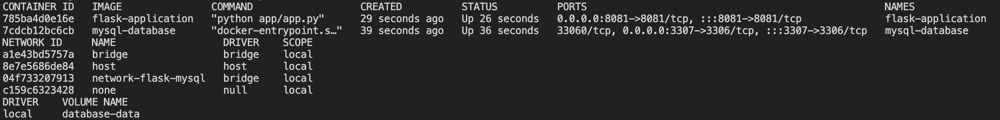

# Ejercicio 2: Docker Run

A continuación se presenta la resolución del ejercicio del Grupo 1.

- **Integrantes grupo 1**
    - Ariadna Gabriela Isis Rouco
    - Alberto Tablon
    - Pablo Alberto Jiménez Artavia
    - Alan Balfour

## Desarrollo

- Primero se realizó una búsqueda de posibles aplicaciones basadas en DB y aplicativo web en el [Docker Hub](https://hub.docker.com/search?type=image)
- Para la solución de la práctica se decidió construir un contenedor con una [API sencilla desarrollada en Python](https://github.com/ariadnarouco/ejercicio2/blob/main/app.py) haciendo uso de la librería **[Flask](https://flask.palletsprojects.com/en/2.0.x/)**  que se comunique con una base de datos MySQL. Para el caso del contenedor de MySQL se utilizó la imagen presentada en el ejemplo de [**Docker Hub de Multi container Apps**](https://docs.docker.com/get-started/07_multi_container/).

### API app.py

Script sencillo para conectarse con la base de datos del contenedor y publicar los datos de la tabla students dentro de [**school.sql**](https://github.com/ariadnarouco/ejercicio2/blob/main/school.sql) de MySQL:

```python
try:
        conn = mysql.connect()
        cursor = conn.cursor(pymysql.cursors.DictCursor)
        cursor.execute("SELECT * FROM students")
        rows = cursor.fetchall()
        resp = jsonify(rows)
        resp.status_code = 200
        return resp
```

# Pasos a seguir para despliegue y uso

1. Se deberá contar con Docker instalado: [Guía completa](https://docs.docker.com/get-started/)
2. Descargar el repositorio localmente
3. Utilizando la **Terminal** ejecutar el script en bash con el nombre de create-env.sh
4. Utilizar el navegador e ingresar: [localhost:8081](http://localhost:8081) 
5. En función de la consulta se puede ver la respuesta a la consulta de la tabla **students**
6. Una vez finalizado el uso y prueba de los contenedores se puede proceder hacer la limpieza de los volúmenes, redes y contenedores a partir de la ejecución del script: [clean.sh](https://github.com/ariadnarouco/ejercicio2/blob/main/clean.sh)


## Ver Artefactos

``` 
docker ps && docker network list && docker volume ls
```




## Archivos

| Archivos  |  Descripción  |   
|---|---|
| README.md          |  Archivo con instrucciones para ejecutar el proyecto. 
|  app.py            |   Apilcación Python|   
|  requirements.txt  |   Archivo que resuelve dependencias de la aplicación Python|   
|  Dockerfile-app    |  Es el Dockerfile de la aplicación hecha en Flask.  |   
|  Dockerfile-db     |  Es el Dockerfile de la base de datos donde especificamos un script en SQL para insertar data en la base de datos (school.sql) |  
|  school.sql |  Archivo con tablas y datos que se insertaran en la base de datos al arrancar el container |  
|  create-env.sh |  Script en bash que contiene los comandos para levantar tanto la aplicación como la base de datos y crea una network para la comunicación directa |   
|  delete-env.sh |  Script que detiene y elimina los containers creados.  |   


